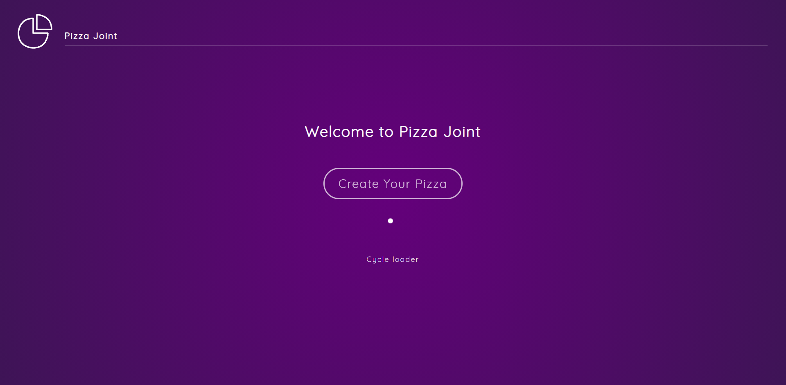

# Framer Motion (for React) 

This project was bootstrapped with [Create React App](https://github.com/facebook/create-react-app). It shows examples of the different animations in the React Library

## Screen




## Getting Started

Install the dependencies and run the development server

```bash
npm install
npm run dev
# or
yarn
yarn dev
```
<br />
Open [http://localhost:3000](http://localhost:3000) to view it in the browser.

The page will reload if you make edits.<br />
You will also see any lint errors in the console.
 
